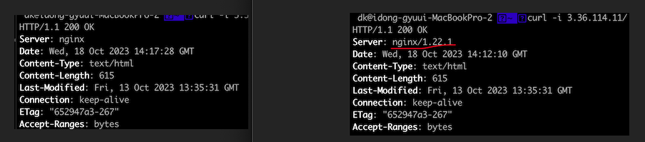

# 웹취약점

## Todo

- [x] Directory Indexing
  - 디렉토리 구조를 가리키는 URL을 요청할때 웹서버 측에서 인덱스 페이지를 응답하여 발생하는 취약점
- [x] Server Token
  - Webserver version이 나타나는 취약점

## Nginx

> Nginx 설치

```sh
sudo yum update
sudo amazon-linux-extras install nginx1
sudo systemctl restart nginx
```

> Directory Indexing

```sh
    server {
	    server_name test.domain.com;

	    location = / {
    		root /var/datas/download;
        	autoindex on; //default: off ## 추가
	    }
    }
```

> Nginx 버전명시

```sh
server {

  listen 80;
  listen [::]:80;
  server_name My_Project_Name;

  # The nginx version is not specified in the response header Because of security.
  # default : on
  server_tokens off;    ## 추가

  location / {

    proxy_pass http://localhost:8080;
    proxy_set_header X-Real-IP $remote_addr;
    proxy_set_header X-Forwarded-For $proxy_add_x_forwarded_for;
    proxy_set_header Host $http_host;
  }
}
```

> After



## Apache
